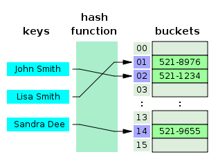

# Dictionary and Sets
dict object keys must be hashable (but the values don't need to be). An object is hashable if it has a hash value that never changes along its life cycle (should have `__hash__()` method) and could be compared to others objects (must have `__eq__()` method.

###  dict comprehension
After python 2.7 the listcomps and genexps sintax has been applied to dict comprehensions.

Example:
```
>> dial_codes = [(1, "EUA"), (7, "Russia"), (55, "Brasil"), (86, "China")]
>> country_codes = {code:country for code, country in dial_codes}
>> country_codes[55]
'Brasil'
```
### Handling missing keys with setdefault
Accordingly to the fail fast philosophy, access to dict with d[k] raises an error when k is an inexistent key. So, if you want to set a value for a `dict` and handle the inexistent key problem, this could be the first idea that may come to your mind:
```
if key not in my_dict:
   my_dict[key] = []
my_dict[key].append(new_value)
```
But the problem here is executing up to three searches for the key. Luckily, Python supports dict.setdefault to search and update a dict in the same execution:
```
my_dict.setdefault(key,[]).append(new_value)
```
Another solution for the same problem would be the use of collections.defaultdict:
```
>> from collections import defaultdict
>> my_dict = defaultdict(list)
>> my_dict["key"]
[]
```
### Imutable mappings
Since Python 3.3 types module offers a wrapper class called MappingProxyType; given a mapping, this class returns a mappingproxy instance, which is a read only view from the original mapping.
Example:
```
>> from types import MappingProxyType
>> d = {1: 'A'}
>> d_proxy = MappingProxyType(d)
>> d_proxy[1]
'A'
>> d_proxy[2] = 'x'
Traceback (most recent call last):
  File "<stdin>", line 1, in <module>
TypeError: 'mappingproxy' object does not support item assignment
>> d[2]='x'
>> d_proxy[2]
```
### Set Theory
The sets are a collection of unique objects. A basic use case is to remove duplications:
```
>> set(l)
{'spam', 'eggs'}
>> list(set(l))
['spam', 'eggs']
```
The set class also implements essential operations for sets like infix operators; that is, given two sets a and b, a | b returns the union, a & b return the intersection, and a - b returns the difference between both sets.
### Set comprehensions
Set comprehensions (_setcomps_) were added to Python 2.7 along with dictcomps. Following an example:
```
>> {letter for letter in list("arara")}
{'a','r'}
```
### Set operations
Python `set` offers math operations. Example below:
```
>> a = {1,2,3}
>> b = {2,3,4}
>> a & b #intesect (and) operator
{2,3}
>> a | b #union (or) operator
{1,2,3,4}
>> a ^ b #exclusive or operator
{1,4}
>> a >= b #is it 'a' a superset of 'b'?
False
>> a <= b #is it 'a' a subset of 'b'?
False
```
###  Hash Tables
Python `dict` and `set` classes are implemented in hash tables. A hash table uses a hash function to compute a hash code into an array of buckets or slots, from which the desired value can be found.



To access the value in `my_dict[search_key]`, the interpreter calls `hash(search_key)` to obtain the _hash value_ of `search_key` and uses the least significants bits of this number as an offset to search for a bucket in the hash table. If the bucket is empty, `KeyError` is raised. Otherwise, the bucket would have an item and the interpreter will verify if `search_key == found_key`. If they are equal, `found_value` will be returned. 