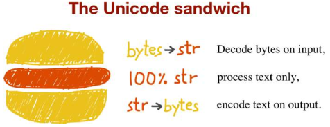

#Character
The concept of “string” is simple enough: a string is a sequence of characters. The items you get out of a Python 3 `str` are Unicode characters. The identity of a character—its code point—is a number from 0 to 1,114,111 (base 10), shown in the Unicode standard as 4 to 6 hexadecimal digits with a “U+” pre‐fix. The actual bytes that represent a character depend on the encoding in use. An encoding is an algorithm that converts code points to byte sequences and vice versa.
``` python
>> s = 'café'
>> len(s) # The str 'café' has four Unicode characters.
4
>> b = s.encode('utf8') # Encode str to bytes using UTF-8 encoding.
>> b
b'caf\xc3\xa9' # bytes literals start with a b prefix
<< len(b) # bytes b has five bytes (the code point for “é” is encoded as two bytes in UTF-8)
5 
>> b.decode('utf8') # Decode bytes to str using UTF-8 encoding.
'café'
```
The above example uses `utf_8` _codec_ to encode/decode. But this is only one in more of 100 codec for text to byte conversion and vice versa. Each codec has a name and often aliases, which you can use as the encoding argument in functions like open() , str.encode() , bytes.decode() as the example below:
``` python
>> for codec in ['latin_1', 'utf_8', 'utf_16']:
... print(codec, 'El Niño'.encode(codec), sep='\t')
latin_1 b'El Ni\xf1o'
utf_8   b'El Ni\xc3\xb1o'
utf_16  b'\xff\xfeE\x00l\x00 \x00N\x00i\x00\xf1\x00o\x00'
```
##UnicodeEncodeError
When converting text to bytes, if a character is not defined in the target encoding, `UnicodeEncodeError` will be raised, unless special handling is provided by passing an errors argument to the encoding method or function.
```python 
>> city = 'São Paulo'
>> city.encode('utf_8') # The 'utf_?' encodings handle any str
b'S\xc3\xa3o Paulo'
>> city.encode('utf_16')
b'\xff\xfeS\x00\xe3\x00o\x00 \x00P\x00a\x00u\x00l\x00o\x00'
>> city.encode('iso8859_1') # 'iso8859_1' also works for the 'São Paulo' str .
b'S\xe3o Paulo'
>> city.encode('cp437') # 'cp437' can’t encode the 'ã' (“a” with tilde). The default error handler raises UnicodeEncodeError
Traceback (most recent call last):
    File "<stdin>", line 1, in <module>
    File "/.../lib/python3.4/encodings/cp437.py", line 12, in encode
        return codecs.charmap_encode(input,errors,encoding_map)
UnicodeEncodeError: 'charmap' codec can't encode character '\xe3' in
position 1: character maps to <undefined>
>> city.encode('cp437', errors='ignore') # The error='ignore' handler silently skips characters that cannot be encoded
b'So Paulo'
>> city.encode('cp437', errors='replace') # When encoding, error='replace' substitutes unencodable characters with '?'
b'S?o Paulo'
>> city.encode('cp437', errors='xmlcharrefreplace') # 'xmlcharrefreplace' replaces unencodable characters with an XML entity.
b'S&#227;o Paulo'
```
##How to Discover the Encoding of a Byte Sequence
How do you find the encoding of a byte sequence? Short answer: you can’t. You must be told. However, considering that human languages also have their rules and restrictions, once you assume that a stream of bytes is human plain text it may be possible to sniff out its encoding using heuristics and statistics.

That is how the package Chardet — The Universal Character Encoding Detector works to identify one of 30 supported encodings. Chardet is a Python library that you can use in your programs, but also includes a command-line utility, `chardetect`
```python 
>> chardetect 04-text-byte.asciidoc
04-text-byte.asciidoc: utf-8 with confidence 0.99
```
##Handling Text Files
The best practice for handling text is the “Unicode sandwich”. This means that bytes should be decoded to str as early as possible on input (e.g., when opening a file for reading). The “meat” of the sandwich is the business logic of your program, where text handling is done exclusively on str objects. You should never be encoding or decoding in the middle of other processing. On output, the str are encoded to bytes as late as possible.

In Django, for example, your views should output Unicode `str` ; Django itself takes care of encoding the response to bytes , using UTF-8 by default.